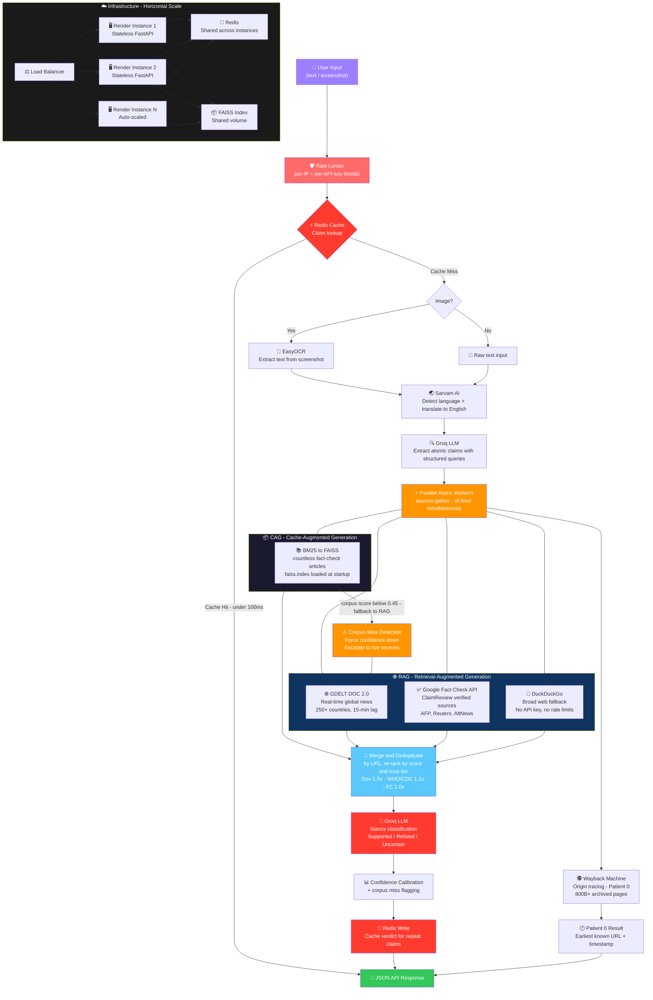

<p align="center">
  <h1 align="center">📡 Viral Claim Radar</h1>
  <p align="center">
    <strong>AI-powered fact-checking for the misinformation age.</strong>
  </p>
  <p align="center">
    Paste a tweet. Forward a WhatsApp chain. Upload a screenshot.<br/>
    Get real-time verification with source-backed evidence, confidence scoring, and origin tracing — in <strong>10 Indian languages</strong>.
  </p>
</p>

<p align="center">
  
  
  
  
  
  
  
  
  
  
  
  
  
  
  
</p>

---

## 🎯 The Problem

Social media misinformation spreads **6× faster** than truth ([MIT, 2018](https://science.sciencemag.org/content/359/6380/1146)). Manual fact-checking can't keep up. By the time a debunk is published, millions have already shared the fake claim.

**Viral Claim Radar** closes this gap. It takes any text or screenshot — in English or 9 Indian languages — and verifies it against a curated fact-check corpus, real-time global news, and multiple web search engines, returning a structured verdict with traceable sources in under 15 seconds.

---

## ✨ Key Features

### 🔍 Intelligent Claim Extraction
LLM-powered structured extraction that decomposes any input into atomic, verifiable claims — each with subject, predicate, intent, and search keywords. Handles everything from formal news headlines to casual WhatsApp forwards and search-style queries.

### 📚 Hybrid Retrieval (BM25 → FAISS)
Two-stage retrieval pipeline: BM25 keyword pre-filtering (512 candidates) followed by FAISS semantic re-ranking (top-8 chunks). Trust-tier boosting prioritizes government advisories (1.5×), verified orgs like WHO/CDC (1.2×), and established fact-checkers (1.0×).

### 🌐 4-Source Parallel Live Search
When the local corpus doesn't have enough signal, the system fires **four parallel live searches** simultaneously:

| Source | What it brings |
|---|---|
| **GDELT DOC 2.0** | 250+ countries, 100+ languages, 6-month rolling window of global news |
| **Google Fact Check API** | Verified fact-checks from ClaimReview-tagged publishers (AFP, Reuters, BOOM, AltNews) |
| **DuckDuckGo HTML** | General web results for broader context |
| **FAISS Corpus** | 2,000+ pre-indexed fact-check articles (AltNews, BOOM, PIB, etc.) |

Results are merged, deduplicated by URL, and re-ranked by relevance score before being fed to the LLM.

### 🧠 Context-Aware Stance Classification
Custom Groq LLM prompt engineered to distinguish between:
- A **fact-check debunking a viral video** (e.g., "this video is fake") vs.
- **The underlying event itself** (e.g., "did this event actually happen?")

This prevents the common failure mode where a fact-checker says "this *video* is fake" and naive systems incorrectly conclude the *event* never happened.

### 🕵️ Patient Zero — Origin Tracing
Traces the earliest known appearance of a claim on the internet using the **Wayback Machine CDX API**. Shows users exactly when and where misinformation first surfaced, helping them understand the viral spread timeline.

### 📸 Screenshot OCR
Upload a screenshot from Twitter, WhatsApp, Instagram, or Facebook — **EasyOCR** extracts the text and feeds it directly into the verification pipeline. No copy-paste needed.

### 🌏 Multilingual Support (10 Indian Languages)
Powered by **Sarvam AI**, supports Hindi, Bengali, Tamil, Telugu, Marathi, Gujarati, Kannada, Malayalam, Punjabi, and Odia. Auto-detects language via Unicode analysis and translates both the input claim AND the final reasoning back to the user's language.

### ⚡ Fully Async Pipeline
Every I/O-bound operation — FAISS search, GDELT, Google FC, DuckDuckGo, Wayback Machine — runs in **parallel via `asyncio.gather`**. Multiple claims are verified concurrently. The entire pipeline typically completes in **8–15 seconds**.



## 🚀 Quick Start

### Prerequisites
- Python 3.10+
- Node.js 18+
- Docker Desktop or another Docker runtime
- API Keys: [Groq](https://console.groq.com/) (free), [Sarvam AI](https://dashboard.sarvam.ai/) (free tier), [Google Fact Check](https://developers.google.com/fact-check/tools/api) (free)

### Setup

```bash
# 1. Clone
git clone https://github.com/krednie/AIfactChecker.git && cd AIfactChecker

# 2. Backend virtual environment
python -m venv .venv
.venv\Scripts\activate           # Windows
# source .venv/bin/activate      # macOS / Linux

# 3. Install Python dependencies
pip install -r backend/requirements.txt

# 4. Configure environment
cp .env.example .env
# Edit .env and fill in: GROQ_API_KEY, SARVAM_API_KEY, GOOGLE_FACT_CHECK_API_KEY
# Redis defaults to redis://localhost:6379/0 for local development

# 5. Start local Redis
docker compose up -d redis

# 6. Verify keys are working
python scripts/test_keys.py

# 7. Build the fact-check corpus & FAISS index
python -m backend.scraper        # Scrapes ~2,000 fact-check articles
python scripts/build_index.py    # Builds FAISS vector index (~18MB)

# 8. Start the backend
python -m backend.main           # → http://localhost:8000

# 9. Start the frontend (new terminal)
cd frontend && npm install && npm run dev    # → http://localhost:3000
```

---

## 🔌 API Reference

### `POST /analyze` — Full Verification Pipeline

```bash
curl -X POST http://localhost:8000/analyze \
  -H "Content-Type: multipart/form-data" \
  -F "text=COVID vaccines contain 5G microchips that track your location"
```

**Response:**
```json
{
  "claims": [
    {
      "claim": "COVID vaccines contain 5G microchips that track your location",
      "stance": "Refuted",
      "confidence": "High",
      "reasoning": "Multiple verified fact-checks from Reuters, AFP, and BOOM Fact Check confirm that COVID-19 vaccines do not contain microchips. The claim originated from a misinterpreted patent filing...",
      "sources": [
        {
          "title": "Fact Check: COVID vaccines do NOT contain microchips",
          "url": "https://www.reuters.com/...",
          "source": "google_fc",
          "source_tier": "verified",
          "score": 0.92
        }
      ],
      "patient0": {
        "earliest_url": "https://web.archive.org/web/20200501.../...",
        "earliest_date": "2020-05-01"
      }
    }
  ]
}
```

### `POST /ocr` — Screenshot Text Extraction

```bash
curl -X POST http://localhost:8000/ocr \
  -F "file=@screenshot.png"
```

### `GET /health` — Liveness Check

Returns FAISS index status, OCR engine availability, and Redis connectivity.

---

## 🛠️ Tech Stack

| Layer | Technology | Why |
|---|---|---|
| **LLM** | Groq (GPT-OSS 120B) | Free tier, blazing fast inference (~300ms), structured JSON output |
| **Embeddings** | all-MiniLM-L6-v2 | Lightweight (80MB), excellent semantic similarity for fact-checking |
| **Vector Search** | FAISS (IndexFlatIP) | Facebook's battle-tested vector similarity, exact inner product |
| **Keyword Search** | BM25Okapi | Classic term-frequency retrieval, catches exact matches FAISS misses |
| **Live News** | GDELT DOC 2.0 | Free, no API key, 250+ countries, 100+ languages, 15-min update lag |
| **Fact Checks** | Google Fact Check API | Aggregates ClaimReview markup from 50+ verified publishers globally |
| **Web Search** | DuckDuckGo HTML | Broad coverage fallback, no API key required |
| **OCR** | EasyOCR | 80+ languages, handles noisy social media screenshots well |
| **Translation** | Sarvam AI (Mayura v1) | Best-in-class for Indian languages, formal/informal mode |
| **Backend** | FastAPI + uvicorn | Async-native, auto OpenAPI docs, production-ready |
| **Frontend** | Next.js 16 + React 19 | Server components, streaming, modern DX |
| **Origin Tracing** | Wayback Machine CDX API | 800B+ archived web pages, timestamp precision |

---

## 📁 Project Structure

```
AIfactChecker/
├── backend/
│   ├── main.py                 # FastAPI entry point, CORS, endpoints
│   ├── config.py               # Centralized settings from .env
│   ├── claim_extractor.py      # Groq LLM → structured claim extraction
│   ├── verifier.py             # RAG orchestrator: retrieval → stance → calibration
│   ├── retriever.py            # BM25 pre-filter → FAISS re-rank → trust-tier boost
│   ├── gdelt_search.py         # GDELT DOC 2.0 live global news search
│   ├── ddg_search.py           # DuckDuckGo HTML scraper + relevance scoring
│   ├── ocr.py                  # EasyOCR screenshot → text
│   ├── multilingual.py         # Sarvam AI language detection + translation
│   ├── patient0.py             # Wayback Machine origin tracing
│   ├── scraper.py              # Corpus builder (Google FC API + RSS feeds)
│   └── requirements.txt        # Python dependencies
│
├── frontend/
│   ├── app/
│   │   ├── page.tsx            # Main UI — claim input, evidence cards, verdict
│   │   ├── layout.tsx          # Root layout + metadata
│   │   └── globals.css         # Custom design system (glassmorphism, animations)
│   ├── package.json
│   └── ...
│
├── scripts/
│   ├── build_index.py          # Embed corpus → FAISS index
│   ├── bulk_scrape.py          # Batch URL scraper for corpus expansion
│   ├── test_keys.py            # API key validation utility
│   └── test_pipeline.py        # End-to-end pipeline smoke test
│
├── data/                       # Generated at runtime (gitignored)
│   ├── scraped_corpus.jsonl    # ~2,000 fact-check articles
│   ├── faiss.index             # ~18MB FAISS vector index
│   └── chunk_meta.pkl          # Chunk metadata for retrieval
│
├── .env.example                # Template for API keys
└── README.md
```

---

## 🔬 How It Works — End to End

1. **Input Processing** — Text is received (or extracted from screenshot via OCR). If non-English, Sarvam AI detects the language and translates to English.

2. **Claim Extraction** — Groq LLM decomposes the input into atomic, verifiable claims, each with structured metadata (subject, predicate, keywords, intent).

3. **Evidence Retrieval** — For each claim, four sources are queried in parallel:
   - BM25 filters 512 keyword candidates from the local corpus, then FAISS re-ranks semantically to find the top 8 chunks
   - GDELT searches global news from the last 6 months
   - Google Fact Check API queries verified ClaimReview sources
   - DuckDuckGo provides broad web coverage

4. **Merge & Dedup** — All results are merged, deduplicated by URL, and re-ranked using a combination of semantic similarity score and trust-tier multipliers.

5. **Stance Classification** — The top 12 evidence chunks + the claim are sent to Groq LLM with a custom prompt that distinguishes between "fake video" debunks and "event didn't happen" debunks.

6. **Confidence Calibration** — If the best corpus score is below 0.45, the system flags a `corpus_miss` and forces the confidence down to prevent hallucinated high-confidence verdicts.

7. **Origin Tracing** — In parallel with steps 3–6, the Wayback Machine CDX API searches for the earliest known occurrence of the claim on the internet.

8. **Response** — Everything is packaged into a structured JSON response with stance, confidence, reasoning, sources (with URLs), and Patient 0 origin data.

---

## 🌐 Supported Languages

| Language | Code | Script |
|---|---|---|
| English | `en` | Latin |
| Hindi | `hi` | Devanagari |
| Bengali | `bn` | Bengali |
| Tamil | `ta` | Tamil |
| Telugu | `te` | Telugu |
| Marathi | `mr` | Devanagari |
| Gujarati | `gu` | Gujarati |
| Kannada | `kn` | Kannada |
| Malayalam | `ml` | Malayalam |
| Punjabi | `pa` | Gurmukhi |

---

## 🏆 Built For

**Google Developer Circle Hackathon 2025** — Track: AI for Social Good

---

## 📄 License

MIT

---

<p align="center">
  <sub>Built with ☕ and righteous anger against misinformation.</sub>
</p>
