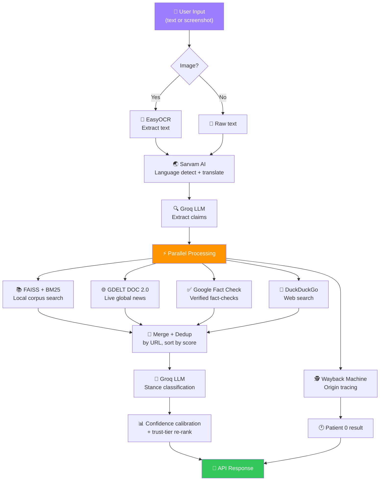

# 📡 Viral Claim Radar

**AI-powered fact-checking copilot for social media misinformation.**

Paste a tweet, WhatsApp forward, or upload a screenshot — get real-time verification with evidence sources, confidence scoring, and origin tracing. Supports English + 9 Indian languages.

---

## ✨ Features

| Feature | Description |
|---|---|
| 🔍 **Claim Extraction** | LLM-powered structured extraction (subject, predicate, keywords, intent) |
| 📚 **RAG Verification** | BM25 → FAISS semantic search over 2000+ fact-check articles |
| 🌐 **Live Search** | Parallel GDELT + Google Fact Check + DuckDuckGo web search |
| 🧠 **Stance Classification** | Groq LLM classifies Supported / Refuted / Uncertain with reasoning |
| 🕵️ **Patient 0** | Traces claim origin via Wayback Machine CDX API |
| 📸 **Screenshot OCR** | EasyOCR extracts text from social media screenshots |
| 🌏 **Multilingual** | 10 Indian languages via Sarvam AI translate |
| ⚡ **Async Pipeline** | Parallel verification + origin tracing for low latency |

---

## 🏗️ Architecture



---

## 🚀 Quick Start

```bash
# 1. Clone & setup
git clone <repo-url> && cd gdc
python -m venv .venv
.venv\Scripts\activate           # Windows
# source .venv/bin/activate      # Mac/Linux

# 2. Install dependencies
pip install -r backend/requirements.txt

# 3. Configure environment
cp .env.example .env             # Fill in API keys

# 4. Build corpus & index
python -m backend.scraper        # Scrape fact-check articles
python scripts/build_index.py    # Build FAISS vector index

# 5. Run backend
python -m backend.main           # → http://localhost:8000

# 6. Run frontend (separate terminal)
cd frontend && npm install && npm run dev  # → http://localhost:3000
```

### Verify API Keys
```bash
python scripts/test_keys.py
```

---

## 🔌 API Endpoints

| Method | Endpoint | Description |
|---|---|---|
| `POST` | `/analyze` | Full pipeline: text/image → claims → verification |
| `POST` | `/ocr` | Extract text from uploaded image |
| `GET` | `/health` | Liveness check (FAISS + OCR status) |

### `POST /analyze`

```bash
curl -X POST http://localhost:8000/analyze \
  -F "text=COVID vaccines contain 5G microchips"
```

**Response:** `AnalysisResponse` with claims, stance, confidence, reasoning, sources, and origin.

---

## 🛠️ Tech Stack

| Layer | Technology |
|---|---|
| **LLM** | Groq (Llama 3) |
| **Embeddings** | all-MiniLM-L6-v2 |
| **Vector DB** | FAISS (IndexFlatIP) |
| **Keyword Search** | BM25Okapi (rank_bm25) |
| **Live Search** | GDELT DOC 2.0 + Google Fact Check API + DuckDuckGo HTML |
| **OCR** | EasyOCR |
| **Translation** | Sarvam AI |
| **Backend** | FastAPI + uvicorn |
| **Frontend** | Next.js 16 + React 19 |
| **Origin Tracing** | Wayback Machine CDX API |

---

## 📁 Project Structure

```
gdc/
├── backend/
│   ├── main.py              # FastAPI app + endpoints
│   ├── config.py            # Settings from .env
│   ├── scraper.py           # Corpus builder (Google FC API + RSS)
│   ├── retriever.py         # BM25 → FAISS retriever + trust-tier re-rank
│   ├── claim_extractor.py   # Groq LLM claim extraction
│   ├── verifier.py          # RAG + stance classification pipeline
│   ├── gdelt_search.py      # GDELT DOC 2.0 live search
│   ├── ddg_search.py        # DuckDuckGo HTML live search
│   ├── ocr.py               # EasyOCR screenshot extraction
│   ├── multilingual.py      # Sarvam AI translation (10 langs)
│   └── patient0.py          # Wayback Machine origin tracer
├── frontend/                # Next.js UI (pastel glassmorphism)
├── scripts/
│   ├── build_index.py       # Embed corpus → FAISS index
│   ├── bulk_scrape.py       # Bulk scraping utility
│   └── test_keys.py         # API key verification
└── data/                    # scraped_corpus.jsonl, faiss.index
```
